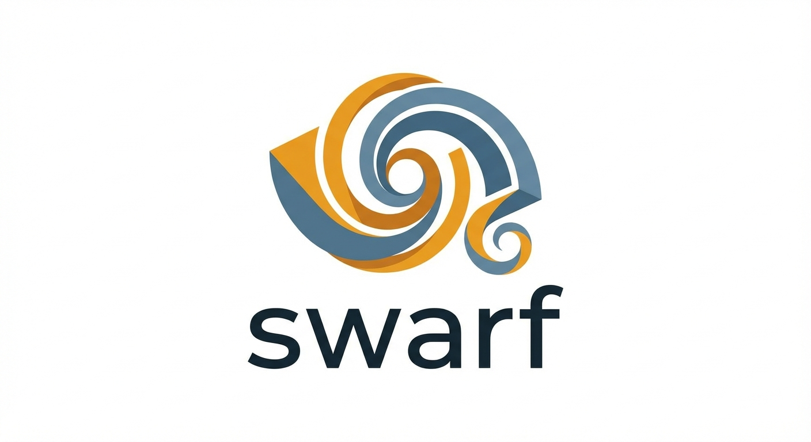

# swarf

> **swarf** /swɔːrf/ — The chips or curls of metal produced by cutting operations.

[](https://github.com/FuturePresentLabs/swarf)

Natural language → DSL → Validated G-code for CNC machining.

## Why?

Writing G-code by hand is tedious and error-prone. CAM software is powerful but slow for simple operations. **swarf** hits the sweet spot: fast to write, easy to read, and generates verifiable output.

```bash
# Natural language to G-code in seconds
swarf --prompt "drill 4 holes at corners of 100x200 plate, depth 10mm"
```

## Quick Start

```bash
# Clone and build
git clone https://github.com/FuturePresentLabs/swarf.git
cd swarf
cargo build --release

# Compile a program
./target/release/swarf examples/bracket.dsl output.nc

# Visualize (with viz feature)
cargo build --release --features viz
./target/release/swarf --viz output.nc
# Opens http://localhost:3030 with live-reloading toolpath preview
```

## Architecture

swarf is a two-stage compiler:

1. **LLM → DSL** — Natural language to structured machining description
2. **DSL → G-code** — Validated, machine-ready output

```
┌─────────────┐     ┌─────────────┐     ┌─────────────┐
│   Natural   │────▶│     DSL     │────▶│   G-code    │
│  Language   │     │  (swarf)    │     │  (.nc/.tap) │
└─────────────┘     └─────────────┘     └─────────────┘
      ↑                    ↑                   ↑
   (OpenAI/            (Rust             (Fanuc/
   Claude/etc)         compiler)          Haas/etc)
```

## DSL Syntax

```dsl
units metric|imperial
offset 54|55|56|57|58|59
coolant flood|mist|off

; Tool definition
tool <n> dia <D> length <L> [flutes <n>] [hss|carbide]
spindle cw|ccw rpm <speed>

; Operations
drill at x <X> y <Y> depth <Z> [peck <p>] [feed <f>]
pocket rectangle|circle at x <X> y <Y> ... depth <Z>
profile inside|outside|on ... depth <Z>
face rectangle ... depth <Z>
tap at x <X> y <Y> depth <Z> pitch <p>
```

## Example

**Input (DSL):**
```dsl
units metric
offset 54

tool 1 dia 6 length 50 flutes 2 carbide
spindle cw rpm 4000

; Drill 4 mounting holes
drill at x 10 y 10 depth 18 peck 6 feed 150
drill at x 90 y 10 depth 18 peck 6 feed 150
drill at x 90 y 90 depth 18 peck 6 feed 150
drill at x 10 y 90 depth 18 peck 6 feed 150

; Pocket in center
pocket rectangle at x 30 y 30 width 40 height 40 depth 10 stepdown 4 feed 800

spindle off
```

**Output (G-code):**
```gcode
; PROGRAM START
N0010 G90 G17 G40 G49 G80
N0020 G21
N0030 G54
; TOOL CHANGE - T1
N0040 M05
N0050 M09
N0060 T1 M06
N0070 S4000 M03
; DRILL CYCLE
...
```

## Features

- ✅ **Natural language input** — Describe operations conversationally
- ✅ **Safety validation** — Catch errors before machine time
- ✅ **Thin feature support** — Fins, walls, small WOC control
- ✅ **Collision avoidance** — Respect fixtures and nearby features
- ✅ **Multiple operations** — Drill, pocket, profile, face, tap
- ✅ **Imperial & metric** — Work in your preferred units
- ✅ **Fanuc-compatible** — Works with most CNC controllers
- ✅ **Live visualization** — Preview toolpaths in browser with auto-reload

## Visualization

swarf includes a built-in G-code visualizer for previewing toolpaths before running them on a machine:

```bash
# Build with viz feature
cargo build --release --features viz

# Start visualizer
./target/release/swarf --viz output.nc
```

**Features:**
- 🌐 Web-based viewer at `http://localhost:3030`
- 📁 Watches file for changes and auto-reloads
- 🎨 Cuts shown in amber, rapid moves in grey
- 🖱️ Pan and zoom with mouse
- 📊 Shows bounds and operation count

Perfect for quickly verifying your program before walking over to the machine!

## Project Structure

```
swarf/
├── Cargo.toml           # Rust project
├── src/
│   ├── main.rs          # CLI entry
│   ├── lexer/           # Tokenizer (logos)
│   ├── parser/          # Recursive descent parser
│   ├── ast/             # Abstract syntax tree
│   ├── codegen/         # G-code generator
│   └── validator/       # Safety checker
├── examples/            # Sample .dsl files
├── docs/
│   └── img/            # Documentation images
├── logo/
│   └── swarf-logo.png  # Project logo
└── README.md
```

## OpenClaw Skill

swarf is also available as an OpenClaw skill for integration with AI agents:

```bash
clawhub run swarf --prompt "profile a fin 1/16 wide x 1/4 tall, 1/8 endmill, 0.003 WOC"
```

See [agent-skills](https://github.com/FuturePresentLabs/agent-skills) for the skill implementation.

## Safety

swarf includes validation to catch common errors:
- Tool length vs cut depth (collision detection)
- Spindle RPM limits
- Feed rate limits
- Rapid moves into workpiece
- Invalid geometry (negative dimensions, etc.)

**Always verify G-code before running on a machine!**

## License

MIT — See [LICENSE](LICENSE) for details.

---

Made with ❤️‍🔥 by [Future Present Labs](https://github.com/FuturePresentLabs)
