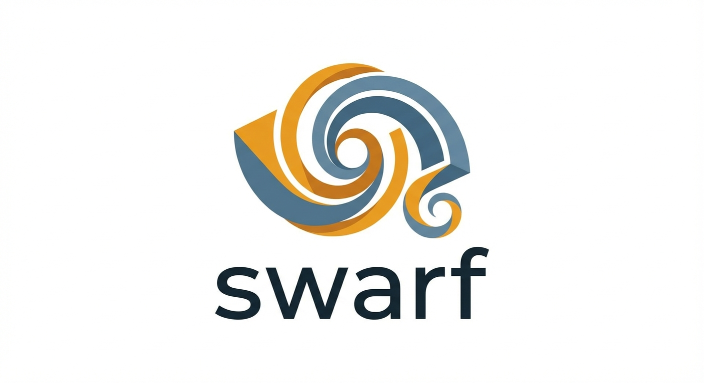

# swarf

> **swarf** /swɔːrf/ — The chips or curls of metal produced by cutting operations.

[](https://github.com/FuturePresentLabs/swarf)

**Write English. Make Chips.**

Natural language → DSL → Validated G-code for CNC machining.

The separate [waterjet library](crates/swarf-waterjet/README.md) accepts Transmog
profiles and produces typed centreline drafts, compensated contour CAM, and
explicit research G-code for WAZER and LinuxCNC waterjets. It does not use milling
feeds or spindle assumptions; exported files remain unqualified for hardware.

## Why?

Writing G-code by hand is tedious and error-prone. CAM software is powerful but slow for simple operations. **swarf** hits the sweet spot: fast to write, easy to read, and generates verifiable output.

```swarf
; Face the stock
stock 4 x 3 x 0.75 Aluminum 6061-T6
tool 1 dia 1.0 flutes 4 carbide
face at stock depth 0.05

; Drill some holes
drill 0.25 at 1.0 0.5 thru
drill 0.25 at 3.0 0.5 thru

; Pocket the center
pocket rect 2.0 1.5 0.25 at 2.0 1.0
```

## Quick Start

```bash
# Clone and build
git clone https://github.com/FuturePresentLabs/swarf.git
cd swarf
cargo build --release

# Compile a program
./target/release/swarf examples/bracket.swarf output.nc

# With specific post-processor
./target/release/swarf program.swarf --post mach3 -o output.nc

# Visualize (with viz feature)
cargo build --release --features viz
./target/release/swarf --viz output.nc
# Opens http://localhost:3030 with live-reloading toolpath preview

# Browse folder of swarf files
./target/release/swarf --viz examples/

# List available post-processors
./target/release/swarf --list-posts
```

## Architecture

swarf is a two-stage compiler:

1. **LLM → DSL** — Natural language to structured machining description (planned)
2. **DSL → G-code** — Validated, machine-ready output with Black Book feeds/speeds

```
┌─────────────┐     ┌─────────────┐     ┌─────────────┐
│   Natural   │────▶│     DSL     │────▶│   G-code    │
│  Language   │     │  (swarf)    │     │  (.nc/.tap) │
└─────────────┘     └─────────────┘     └─────────────┘
      ↑                    ↑                   ↑
   (Planned)            (Rust            (Fanuc/Haas/
                        compiler)         LinuxCNC/Mach3)
```

## DSL Syntax (v2)

The new minimal syntax focuses on **what** you want to make, not **how** to machine it.

### Setup

```dsl
stock 3x2x0.5 6061-T6           ; Stock dimensions and material
setup {
    zero right back bottom      ; Work coordinate origin
    material Aluminum 6061-T6   ; For Black Book feeds
    z-min 0                     ; Hard floor - never go below
    y-limit -0.25               ; Travel constraint
}
```

### Operations

```dsl
; Face mill the top
tool 1 dia 1.0 flutes 4 carbide
face at stock depth 0.05        ; Remove 0.05" from top

; Drill holes (Black Book calculates RPM, feed, peck)
drill 0.25 at 1.0 0.5 thru     ; Through hole
drill 0.125 at zero depth 0.5   ; Blind hole at origin

; Pocket (auto-calculated stepdown/stepover)
pocket 2.0 1.5 0.25 at 0.5 0.5  ; width height depth at x y
pocket circle 1.0 0.25 at 1.0 1.0  ; Circular pocket

; Directional cuts (for slots, trenches)
cut Y+ 5/8 1/8 0.3 Z+ at zero   ; direction sweep depth height Z-constraint
```

### Key Concepts

- **`at X Y`** — Explicit position
- **`at zero`** — Work origin (0, 0)
- **`at stock`** — Stock boundary/center
- **Fractions** — `5/8`, `1/4`, `3/16` (machinist-friendly)
- **`Z+`/`Z-`** — Z movement constraints (no plunge, plunge only)

## Example: Complete Program

**Input (DSL):**
```dsl
stock 4x3x0.75 Aluminum 6061-T6

setup {
    zero left front top
    material Aluminum 6061-T6
}

tool 1 dia 1.0 flutes 4 carbide

; Face the top
face at stock depth 0.05

; Drill mounting holes
drill 0.25 at 0.5 0.5 thru
drill 0.25 at 3.5 0.5 thru
drill 0.25 at 3.5 2.5 thru
drill 0.25 at 0.5 2.5 thru

; Pocket in center
pocket 2.0 1.5 0.25 at 2.0 1.5

; Clean up the edges
tool 2 dia 0.5 flutes 4 carbide
profile outside at stock offset 0.1
```

**Output (G-code):**
```gcode
; ================================================
; CUTTING PARAMETERS SUMMARY - SANITY CHECK THIS!
; ================================================
; Material: Aluminum 6061-T6
; Tool: 1.00 dia, 4 flutes, Carbide
; RPM: 4582
; Feed Rate: 91.2 IPM
; Max DOC (stepdown): 0.800
; Max WOC (stepover): 0.400
; Chip Load: 0.0050 IPT
; ================================================
; PROGRAM START
...
```

## Features

- ✅ **The Black Book** — Built-in feeds/speeds database (20+ materials)
- ✅ **Auto-calculated parameters** — RPM, feed, DOC, WOC from material + tool
- ✅ **Cutting summary header** — Sanity check values before running
- ✅ **Safety validation** — Work hardening detection, tool deflection warnings
- ✅ **Post-processors** — Mach3, LinuxCNC, Haas, Generic Fanuc
- ✅ **Minimal DSL** — Write English. Make Chips.
- ✅ **Fractions** — 5/8 not 0.625
- ✅ **Imperial & metric** — Work in your preferred units
- ✅ **Live visualization** — Preview toolpaths in browser with auto-reload

## The Black Book

swarf includes a comprehensive machining data reference:

- **20+ materials**: Aluminum (6061, 7075, 2024), Steel (1018, 4140, A2), Stainless (304, 316, 17-4PH), Titanium, Inconel, Cast Iron, Brass, Copper
- **SFM ranges** by tool material (HSS, Carbide, Coated, Ceramic)
- **Chip loads** indexed by tool diameter
- **Chip thinning compensation** for low radial engagement
- **Safety warnings** for work hardening, heat buildup, tool deflection

Data sourced from Harvey Tool, Machinery's Handbook, and Kennametal.

## Post-Processors

swarf generates controller-specific G-code:

```bash
./target/release/swarf program.dsl --post mach3 -o output.nc
```

| Post-Processor | Description |
|----------------|-------------|
| `generic` | Fanuc-compatible (default) |
| `mach3` / `mach3-mill` | Absolute XYZ Mach3 Mill; expanded G81/G82/G83; dwell seconds |
| `mach3-mill-ms` | Mach3 Mill configured for millisecond dwell |
| `mach4` / `mach4-mill` | Separate absolute XYZ Mach4 Mill profile; dwell seconds |
| `grblhal-mill` / `fluidnc-mill` | Bounded absolute XYZ mill; expanded cycles; mandatory manual tool pauses |
| `grblhal-laser` / `fluidnc-laser` | Separate typed XY laser jobs with explicit power/feed bounds; use `--laser-job` |
| `linuxcnc` | LinuxCNC |
| `haas` | Haas with controller-specific headers |

Mach profiles reject missing/invalid cycle parameters and unsupported operations.
Read the [profile contract and qualification limits](docs/mach-mill.md), or
use `swarf --post-capabilities mach4-mill` for capability JSON. These exports
have simulator coverage; Mach runtime and hardware qualification remain pending.

[Embedded controller contracts](docs/embedded-posts.md) cover separate mill/laser
semantics, manual tool handling, controller version/configuration assumptions,
127-byte output blocks, and typed laser JSON. Embedded runtime and hardware
qualification remain pending; mill output cannot be relabelled as a laser job.

## Visualization

### 2D Visualizer (Built-in)

```bash
cargo build --release --features viz
./target/release/swarf --viz output.nc      # Default view
./target/release/swarf --viz --2d output.nc # Force 2D
```

Features: Live reload, pan/zoom, 2D top-down view

### 3D WASM Visualizer

Pure Rust + WebGL + WASM. Built automatically with `viz-3d` feature:

```bash
# Install wasm-pack if needed
cargo install wasm-pack

# Build with 3D viz support
cargo build --release --features viz-3d

# Run (uses 3D by default)
./target/release/swarf --viz output.nc

# Force 2D view
./target/release/swarf --viz --2d output.nc
```

**3D Features:**
- True 3D rendering with depth
- Color-coded: grey (rapid), amber (cut), cyan (arc)
- Orbit/pan/zoom camera
- Drag & drop file loading

Or build manually from `swarf-viz-wasm/`:
```bash
cd swarf-viz-wasm
wasm-pack build --target web --out-dir pkg
python3 -m http.server 8080
```

## Project Structure

```
swarf/
├── Cargo.toml           # Rust project
├── src/
│   ├── main.rs          # CLI entry
│   ├── lexer/           # Tokenizer (logos)
│   ├── parser/          # Recursive descent parser
│   ├── ast/             # Abstract syntax tree
│   ├── codegen/         # G-code generator
│   ├── validator/       # Safety checker
│   ├── black_book/      # Feeds/speeds database
│   └── post/            # Post-processors
├── examples/            # Sample .dsl files
├── swarf-viz-wasm/      # 3D WebGL visualizer
├── DSL.md              # DSL specification
└── README.md
```

## Safety

swarf includes validation to catch common errors:
- **Work hardening** — Low feed warnings for stainless/titanium
- **Tool deflection** — L/D ratio checks
- **Tool length vs cut depth** — Collision detection
- **RPM limits** — By tool diameter and material
- **Feed rate limits** — Machine capacity checks

**Always verify G-code before running on a machine!**

## Roadmap

- [ ] OpenClaw skill for AI agent integration
- [ ] Pattern operations (grid, circle, line)
- [ ] Tool library JSON
- [ ] Advanced profiling (pocket islands, adaptive clearing)
- [ ] Surface finish estimation

## License

AGPL-3.0 — See [LICENSE](LICENSE) for details.

This program is free software: you can redistribute it and/or modify it under
the terms of the GNU Affero General Public License as published by the Free
Software Foundation, either version 3 of the License, or (at your option) any
later version.

Contributors must sign the CLA assigning copyright to Future Present Labs LLC.
See [CLA.md](CLA.md) and [CONTRIBUTING.md](CONTRIBUTING.md).

---

Made with ❤️‍🔥 by [Future Present Labs](https://github.com/FuturePresentLabs)
